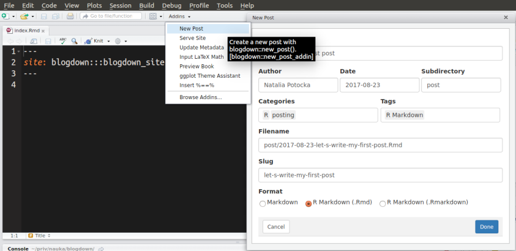

```{r, include=FALSE}
htmltools::tagList(rmarkdown::html_dependency_font_awesome())
library(knitr) 
opts_chunk$set(
	comment = "",
	fig.width = 12, 
	message = FALSE,
	warning = FALSE,
	tidy.opts = list(
		keep.blank.line = TRUE,	
		width.cutoff = 150
		),
	options(width = 200),
	eval = TRUE
)
```

# Dlaczego `blogdown`?

## Mały podgląd


## Zalety

- statyczne strona internetowa
- strona generowana wyłącznie przy użyciu R Markdowna:
    + możliwość generowania wyników analiz przy użyciu R
    + łatwa konwersja do innych typów plików (pdf itd.)
    + możliwość pisania dokumentacji technicznej (LaTeX itd.)
- możliwość używania różnych generatorów: Hugo, Jekyll, Hexo

Hugo:

- łatwa instalacja
- szybki
- aktywna społeczność

# Zaczynamy!

## Software

- R
- RStudio (opcjonalnie :))
- pakiet `blogdown`
- Hugo: 

```{r,eval=FALSE}
blogdown::install_hugo()
```

## Pierwsze kroki

1. Ściągnij odpowiadający motyw (theme): http://themes.gohugo.io/
1. Stwórz nowy projekt
2. Wywołaj funkcję `blogdown::new_site()` w argumencie podając motyw

I gotowe - właśnie stworzyłe/aś kompletną stronę internetową :)


# Dodawanie wpisów

## Nowy wpis

- Automatyczne przeładowywanie strony: `options(servr.daemon = TRUE)`, a następnie `blogdown::serve_site()` lub wybranie tej opcji z `Addins`
- Nowy wpis: `blogdown::new_post()` lub wybranie tej opcji z `Addins`



## Nowy wpis

Po zapisaniu pliku `*.Rmd` wszystkie zmiany pojawiają się automatycznie:


# Struktura projektu

## Struktura

1. Konfiguracja strony: `config.toml`.

2. Zawartość strony (z plikami `.Rmd`): folder `content`.

3. Strona gotowa do opublikowania: folder `public`.


```bash
├── archetypes
├── blogdown.Rproj
├── config.toml
├── content
│   ├── about.md
│   └── post
├── data
├── index.Rmd
├── layouts
├── public
│   ├── 2015
│   ├── 2016
│   ├── 2017
│   ├── about
│   ├── categories
│   ├── css
│   ├── fonts
│   ├── images
│   ├── index.html
│   ├── index.xml
│   ├── js
│   ├── post
│   ├── sitemap.xml
│   └── tags
├── static
│   └── post
└── themes
    └── hugo-lithium-theme

```
## Konfiguracja

Plik `config.toml`:

```bash
baseurl = "/"
languageCode = "en-us"
title = "A Hugo website"
theme = "hugo-lithium-theme"

[[menu.main]]
    name = "About"
    url = "/about/"
[[menu.main]]
    name = "GitHub"
    url = "https://github.com/rstudio/blogdown"
[[menu.main]]
    name = "Twitter"
    url = "https://twitter.com/rstudio"
```

Wszystkie opcje dostępne są tutaj: [https://gohugo.io/getting-started/configuration/](https://gohugo.io/getting-started/configuration/)

## Opcje TOML

- `permalinks` - sposób tworzenia linków: opcja `slug`
- `publishDir` - folder, w którym generowana będzie strona
- `theme` - motyw, na którym budujemy stronę
- `ignoreFiles` - pliki i foldery do ignorowania przy budowie strony, np. pliki `*.Rmd`
- `uglyURLs` - równe `false`: `foo.md` generuje `foo/index.html`; równe `true`: `foo.md` generuje `foo.html`

## Folder `content`

```bash
├── _index.md
├── about.md
├── vitae.md
├── post/
│   ├── 2017-01-01-foo.md
│   ├── 2017-01-02-bar.md
│   └── ...
└── ...
```

## Opcje YAML

Każdy post zaczyna się od specyfikacji w YAMLu.

- `draft` - widoczne tylko na lokalne stronie 
- `publishdate` - można określić datę publikacji (widoczne tylko na lokalnej stronie)
- `weight` - waga, którą można określić przy sortowaniu postów
- `slug` - końcówka URLa zdefiniowana raz, nawet jeśli zmieni się tytuł

## Opublikowanie

- Wykupienie domeny - płatne
- Netlify - strona w domenie `netlify.com`, najlepiej w połączeniu z GITem
- Updog - przekształca folder Dropboxa lub GoogleDrive w stronę internetową
- GitHub - publikowanie przy użyciu brancha `gh-pages`

# Podsumowanie

## Nowa strona

1. Wybierz motyw ze strony: http://themes.gohugo.io/
2. Stwórz nowy projekt w RStudio
3. Stwórz stronę z wybranym motywem: `blogdown::new_site(theme = 'user/repo')`
4. Zmień konfigurację (plik `config.toml`)

## Edytowanie strony

1. Ustaw opcję `options(servr.daemon = TRUE)`
2. Wybierz z `Addins` opcję `Serve site`
3. Wybierz z `Addins` opcję `New post`
4. Wybierz z `Addins` opcję `Update metadata`, jeśli jest taka potrzeba


# Dziękuję za uwagę
  
## Żródła

Dokumentacja blogdowna: https://bookdown.org/yihui/blogdown/

Prezentacja dostępna na GitHubie: https://potockan.github.io/whyr2017/


